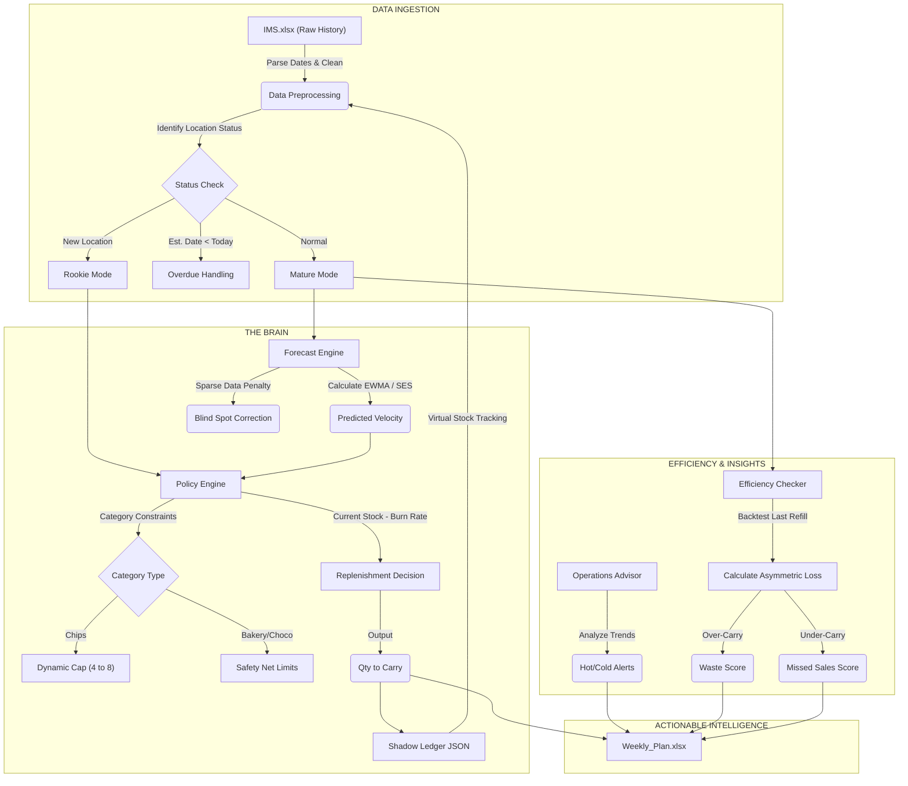

# Zero-Budget Inventory AI (The "Micro-ERP")

> **An autonomous, algorithm-driven inventory management system developed to optimize vending machine operations with zero recurring SaaS costs.**

## 📖 Overview
Managing inventory for distributed retail points (vending machines) typically requires expensive ERP software or results in significant inefficiency via manual guessing.

This project is a **Python-based "Micro-ERP"** built from scratch to solve the "Travelling Salesman Problem" of inventory: **What exactly should a driver carry to maximize sales while minimizing load and waste?**

It ingests raw historical data, applies **Exponential Smoothing (SES)** for demand forecasting, and uses a **Dynamic Policy Engine** to generate precise weekly replenishment plans.

---

## 🧠 System Architecture

The following logic flow represents how the system processes raw data into actionable decisions:

## 🚀 Key Features & Logic

The system is not just a calculator; it's a decision-making engine comprised of several logic modules:

### 1. 🔮 Adaptive Demand Forecasting (Forecast Engine)
* **Algorithm:** Uses **Simple Exponential Smoothing (SES)** to predict sales velocity per SKU per location.
* **Blind Spot Correction:** Automatically detects "Sparse Data" scenarios. If a machine was empty (stockout), the system recognizes that zero sales $\neq$ zero demand, and applies a **Blind Spot Penalty** to adjust the forecast upward to reflect true demand.

### 2. 🛡️ Dynamic Cap Strategy (Policy Engine)
* **Smart Inventory Caps:** Instead of fixed slots, the system dynamically adjusts the "Cap" (maximum stock) for each item based on its selling speed.
    * *Fast Movers (e.g., Chips):* Auto-promoted to high-capacity slots (8 units).
    * *Slow Movers:* Relegated to standard slots (4 units) to free up capital and space.
* **Safety Nets:** Hard-coded constraints for sensitive categories (e.g., Chocolates, Bakery) to prevent melting or expiration risks regardless of sales velocity.

### 3. 🚦 Lifecycle Management (Rookie vs. Mature)
* **Rookie Mode:** New locations enter a "probation period" (first 5 visits). The system uses aggressive, fixed rules to test market fit without relying on statistical noise from insufficient data.
* **Mature Mode:** Once sufficient data is collected, the system automatically switches to pure statistical forecasting.

### 4. 👻 The "Shadow Ledger" (Virtual Inventory)
* Tracks inventory levels even when drivers *don't* visit a machine.
* Simulates "virtual burn" logic to estimate current stock levels between physical visits, allowing for precise **Overdue Analysis** and preventing "blind" periods in data.

### 5. ⚖️ Efficiency Backtesting (The Referee)
* **Asymmetric Loss Calculation:** Every time a driver visits, the system "grades" the previous refill decision:
    * **Over-Carry (Waste):** Did we carry too much stock that resulted in dead weight?
    * **Under-Carry (Missed Revenue):** Did we stock out, losing potential profit?
* Generates an **Efficiency Score** for each location to drive operational improvements.

### 6. 🩺 Operational Advisor
* **Health Checks:** Automatically flags "Hot" items (high risk of immediate stockout) and "Cold" items (candidates for delisting).
* **Opportunity Cost Analysis:** Identifies items that are occupying valuable space but generating low returns.

---

## 🛠️ Tech Stack
* **Core:** Python 3.12
* **Data Processing:** Pandas, NumPy
* **Storage:** Local JSON (NoSQL-style document store for persistent state)
* **Reporting:** XlsxWriter (Automated Excel Report Generation)

## 📂 Project Structure
* `main.py`: The entry point that orchestrates the data pipeline.
* `core_logic.py`: Handles the iteration through locations and products.
* `forecast_engine.py`: Pure math module for SES calculations.
* `policy_engine.py`: Business logic for Cap adjustments and Rookie/Mature switching.
* `efficiency_checker.py`: Backtesting module for calculating waste and missed sales.
* `storage_manager.py`: Manages the JSON database (Shadow Ledger).

## 📈 Future Roadmap
* **Expiry Forensics:** Reverse-engineering expiration risks by correlating "First Seen Date" with historical refill batches to predict hidden spoilage.
* **Route Optimization:** Integrating map APIs to sort the replenishment list by optimal driving path.
